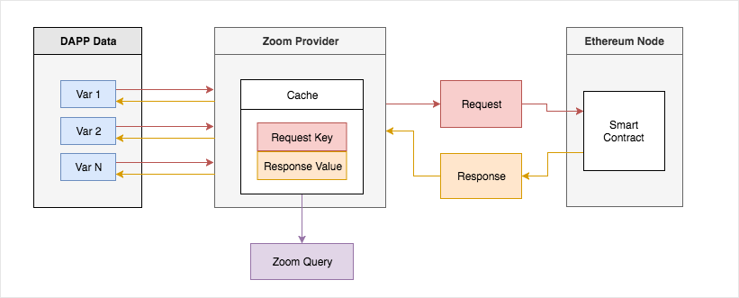
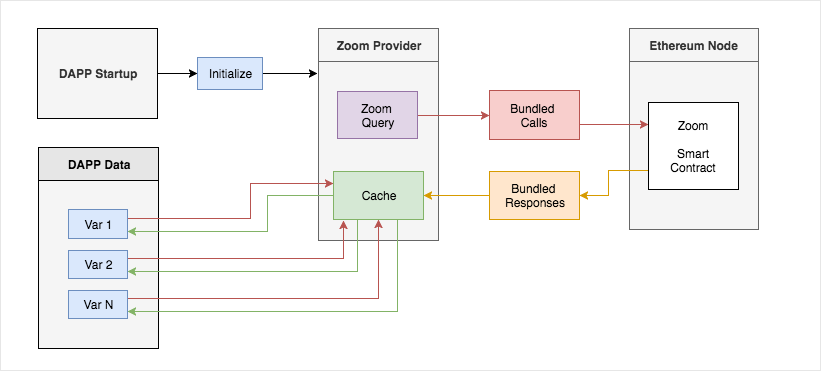
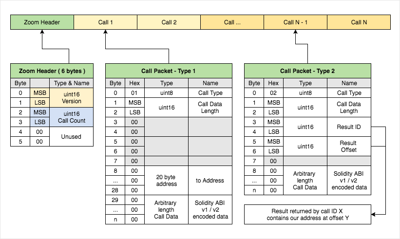

# Zoom

## 1. Description

Is a set of tools created in order to make Distributed Applications ( DAPPs ) load faster with optimised network calls and reduced resource usage on Ethereum nodes that process their requests.

Zoom bundles multiple web3 calls into **one call** that is then sent to an EVM ( Ethereum Virtual Machine ), processed and then once the result is received, it builds a "key / value cache" that will serve the application's data loading needs.

```javascript
// rinkeby
const ZoomContract_address   = "0xe07a33e2975b7012eb9bf002aa12aba98d7069dc";

// ropsten
const ZoomContract_address   = "0x06015a207fb22eb6d81585e1694c8fff405ee4a4";
```

## 2. Modes

### 2.1. Type 1 calls

Normal Solidity ABI v1/v2 encoded calls

### 2.2. Type 2 calls

Known as referenced calls, can be enabled by the "use_reference_calls" setting.

```solidity
// Code example:

contract ListContract {

    struct Item {
        string name;
        address itemAddress;
        bool    status;
        uint256 index;
    }
    mapping ( uint256 => Item ) public items;

}

contract ItemEntity {

    string public name;
    uint256 public age;
    string public location;
    string public imageUrl;

}

```

Lets say for example that you have contract **ListContract** which indexes "items" in a mapping, and each item has a bunch of properties that you want to read.

Once your application is profiled and all data is loaded from the blockchain, the Zoom Binary Call builder knows that a call to "ListContract.items( N ) will return the address of an item, that will later be used as a to Address"

In this case, it can create a type 2 call which can then use that result's position and the next 20 bytes as the "call to address".

- **Note:** is useful for proxy contracts, which have items with dynamic addresses. ( think about upgradeable smart contracts )
- `Enable with caution!` ( it can fail if the "item" address exists in multiple results )

```javascript
const ZoomLibraryInstance = new ZoomLibrary.Zoom(
    { use_reference_calls: true }
);
```

## 3. Usage details

### 3.1. Installing Zoom

Add the Zoom package to your project.

```bash
npm install zoom.js --save
```

### 4.2. Profiling Your Application

1. Replace your current Web3.js Provider with a new ZoomLibrary.HttpProvider instance, with cache enabled.
2. Load all the data you need
3. Call **ZoomLibraryInstance.getZoomCall**( ZoomProvider.cache ) to create the ZoomQueryBinary
4. Save the output of **ZoomQueryBinary** in a variable or file for later usage

```javascript
const ZoomLibrary = require("zoom.js");

// Custom Zoom Provider
const ZoomProvider = new ZoomLibrary.HttpProvider( "https://ropsten.infura.io/" );

// Enable result caching so we can record calls
ZoomProvider.enableCache(true);

// Pass our provider to a new or existing Web3 object.
const Web3 = new Web3( ZoomProvider );

/*

 Load your application data
 Init Smart Contracts
 Load properties

*/

// Once everything is loaded instantiate the Zoom Library
const ZoomLibraryInstance = new ZoomLibrary.Zoom({
    use_reference_calls: false // true if you want to use type 2
});

// Prepare the "Zoom Query"
const ZoomQueryBinary = ZoomLibraryInstance.getZoomCall( ZoomProvider.cache );

// save ZoomQueryBinary in a file or a variable for later usage
console.log( ZoomQueryBinary.toString("hex") );

/*

0001001400000100040000000000a7e4b1d39cab62bc7b7503ce0e4472cc4c5481470bcd3b330100040000000000a7e4b1d39cab62bc7b7503ce0e4472cc4c54814717d7de7c0100040000000000a7e4b1d39cab62bc7b7503ce0e4472cc4c5481471cf61bdc0100040000000000a7e4b1d39cab62bc7b7503ce0e4472cc4c5481471f9030370100040000000000a7e4b1d39cab62bc7b7503ce0e4472cc4c548147343a875d0100040000000000a7e4b1d39cab62bc7b7503ce0e4472cc4c54814738cc48310100040000000000a7e4b1d39cab62bc7b7503ce0e4472cc4c548147446fd9f00100040000000000a7e4b1d39cab62bc7b7503ce0e4472cc4c54814744d423d50100040000000000a7e4b1d39cab62bc7b7503ce0e4472cc4c548147475a7bf10100040000000000a7e4b1d39cab62bc7b7503ce0e4472cc4c54814754e176320100040000000000a7e4b1d39cab62bc7b7503ce0e4472cc4c54814756e1b15c0100040000000000a7e4b1d39cab62bc7b7503ce0e4472cc4c5481475c222bad0100040000000000a7e4b1d39cab62bc7b7503ce0e4472cc4c5481475f0c9a6b0100040000000000a7e4b1d39cab62bc7b7503ce0e4472cc4c548147688959790100040000000000a7e4b1d39cab62bc7b7503ce0e4472cc4c548147799136990100040000000000a7e4b1d39cab62bc7b7503ce0e4472cc4c548147db14c8000100040000000000a7e4b1d39cab62bc7b7503ce0e4472cc4c548147c3334ff80100040000000000a7e4b1d39cab62bc7b7503ce0e4472cc4c548147d0369b3f0100040000000000a7e4b1d39cab62bc7b7503ce0e4472cc4c548147c7c655de01002400000000001d5cb16376911d3832efb4130670c4a6a47fb82fbfb231d20000000000000000000000000000000000000000000000000000000000000001

*/

```

Process diagram:



---

### 4.3. Using Zoom

1. Require ZoomLibrary / ZoomABI / ZoomQueryBinary
2. Replace your current Web3.js Provider with a new ZoomLibrary.HttpProvider instance, with cache enabled.
3. Initialize the Zoom Web3 Contract ( ABI in build/contracts/Zoom.json ) / address depending on network
4. Call the Zoom Smart Contract and pass the ZoomQueryBinary
5. Parse the result and set the new application state

**Note**: A proper application state store ( vuex store / redux ) should be preferred instead of the "AppProvider"

```javascript
const ZoomLibrary = require("zoom.js");
const ZoomABI = require("./build/contracts/Zoom.json");
const ZoomQueryFile = require("./ZoomQueryBinary.json");
const ZoomQueryBinary = Buffer.from( ZoomQueryFile.data, "hex" );

// Instantiate the Zoom Library with default config
const ZoomLibraryInstance = new ZoomLibrary.Zoom();

// Create the two providers
// ZoomProvider is used for "zoom"
const ZoomProvider = new ZoomLibrary.HttpProvider( "https://ropsten.infura.io/" );


// AppProvider is used by the application as a state
const AppProvider = new ZoomLibrary.HttpProvider( "https://ropsten.infura.io/" );
// Enable result caching so we can store results
AppProvider.enableCache(true);


// Pass our providers to a new or existing Web3 object.
const web3Zoom = new Web3( ZoomProvider );
const web3 = new Web3( AppProvider );

// Zoom @ Ropsten
const ZoomContract_address = "0x06015a207fb22eb6d81585e1694c8fff405ee4a4";

// Initialize the Zoom Web3 Contract
const ZoomContractInstance = await new web3Zoom.eth.Contract(ZoomABI.abi, ZoomContract_address);


// You can run this once at startup, or each time a block changes
// ----------
// Execute ZoomQuery
const combinedResult = await ZoomContractInstance.methods.combine( ZoomQueryBinary );

// Parse result
const newDataCache = ZoomLibraryInstance.resultsToCache( combinedResult, ZoomQueryBinary );

// Load into "provider cache"
AppProvider.setCache( newDataCache );
// ----------

/*

 Load your application data
 Init Smart Contracts
 Load properties

*/

```

Process diagram:



---

## 5. Benchmarks

### 5.1. Results

|                        |    Ganache   |    Infura    |    Parity    |     Geth     |
|:----------------------:|:------------:|:------------:|:------------:|:------------:|
|     Zoom Call is X     | Times Faster | Times Faster | Times Faster | Times Faster |
|    Asynchronous HTTP   |   2.698928   |   2.381501   |   15.485504  |   23.867573  |
| Asynchronous WebSocket |   2.507113   |   22.689466  |   1.740879   |   1.908162   |

### 5.2. Details

Ran on [Test Runner Machine](###-5.3.2.-Test-Runner) using **NodeJs - v8.7.0**.

Smart Contract property requests: **2000**

- Ethereum Node Software Versions
  - Ganache-cli/6.1.8
  - Infura - unknown
  - Parity-Ethereum/v2.2.2-beta-78ceec6-20181129/x86_64-linux-gnu/rustc1.30.1
  - Geth/v1.8.19-stable-dae82f09/linux-amd64/go1.10.4

|         Call Type / Node        |  Ganache |  Infura  |  Parity  |   Geth   |
|:-------------------------------:|:--------:|:--------:|:--------:|:--------:|
|  Synchronous WebSocket Provider | 0.008926 | 0.186434 | 0.002070 | 0.001839 |
| Asynchronous WebSocket Provider | 0.007018 | 0.024754 | 0.000207 | 0.000147 |
|    Asynchronous HTTP Provider   | 0.007555 | 0.002598 | 0.001842 | 0.001848 |
|          Zoom Provider          | `0.002799` | `0.001090` | `0.000118` | `0.000077` |

- Notes:
  - Infura times are increased due to network latency ( ~ 320ms round trip, EU <-> US ) and seem to suggest Async HTTP to be better even thou you should never open 2k connections from your client to their load balancer.
  - Ganache tests are run on the same machine using newly deployed data
  - Parity and Geth tests are run in the local network on Ropsten

### 5.3. Test Machines

#### 5.3.1. Ethereum Nodes

- Type: VirtualBox Guest Machine
- OS: Ubuntu-16.04.4-server-amd64
- Uname: Linux 4.15.0-42-generic #45-Ubuntu SMP Thu Nov 15 19:32:57 UTC 2018 x86_64 x86_64 x86_64 GNU/Linux
- CPU: 2 x Intel(R) Core(TM) i3-4160 CPU @ 3.60GHz
- RAM: 4 GB RAM
- Storage: 60 GB SSD

#### 5.3.2. Test Runner

- Type: Bare metal
- OS: MacOS Sierra - 10.12.6 (16G29)
- Uname: Darwin 16.7.0 Darwin Kernel Version 16.7.0: Thu Jun 15 17:36:27 PDT 2017; root:xnu-3789.70.16~2/RELEASE_X86_64 x86_64
- CPU: Intel(R) Core(TM) i7-7700K CPU @ 4.20GHz
- RAM: 16 GB 2133 MHz DDR4
- Storage: 500 GB SSD

## 6. Technical Details

### 6.1. ZoomQuery Buffer Specifications



## 7. Usage examples

Wallets, Drizzle, Metamask could start loading every single property like account balances / smart contract properties in ONE call instead of doing multiple calls.

## 8. The Future

### 8.1. Custom View Builder

Think about a "product page" or a "crypto kitty page" that loads a specific set of properties / variables each time it loads a different id.

Instead of first loading the item's address, then iterating through contracts that hold additional data, why not combine all these calls into one ?

A ZoomQuery would be composed of:

- One type 1 call, "indexContract.items( N )" which returns the "item's address"
- Any number of type 2 calls, that reference the "resulting address in call 1"

**Note**: this is possible today, but not very friendly to use as it needs a dummy profiling run in order to generate the ZoomQuery.

## License

MIT
